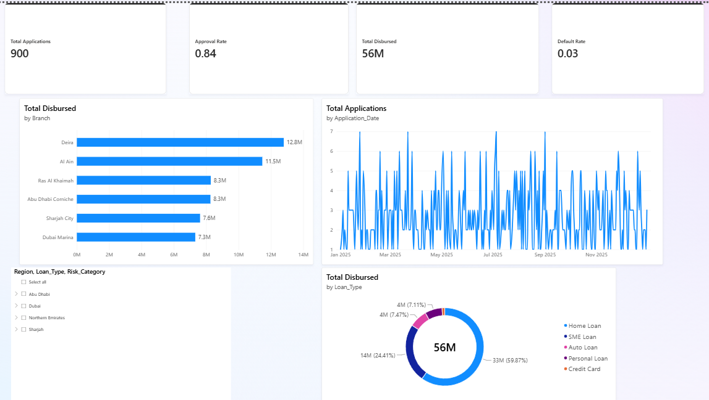

# loan-portfolio-powerbi-dashboard
Interactive Power BI dashboard analyzing loan approval, disbursement, and default risk across UAE branches
# Loan Portfolio Performance Dashboard — Power BI

An interactive Power BI dashboard analysing loan approval, disbursement, and default risk across six UAE bank branches, built to support portfolio-level decision-making on approvals, branch performance, and risk exposure.

## Business question

Which branches and loan types are driving the strongest disbursement volume, and where is default risk concentrated across the portfolio?

## Tools used

- **Power BI Desktop** — data modelling, DAX measures, report design
- **DAX** — CALCULATE, DIVIDE, SUM for dynamic, filter-aware KPIs
- **Power Query** — data cleaning and type validation
- **Excel** — source dataset (900 loan applications, UAE branches, FY2025)

## Dashboard overview

**Page 1 — Portfolio Overview**



KPI cards for Total Applications, Approval Rate, Total Disbursed, and Default Rate, alongside branch-level disbursement, monthly application trends, and loan-type portfolio mix — all filterable by Region, Loan Type, and Risk Category.

**Page 2 — Risk & Defaults**


A Risk Category × Loan Type matrix with a conditional-formatting heatmap on default rate, alongside a stacked bar chart showing risk composition by branch.

## Key DAX measures

```dax
Total Applications = 
COUNTROWS(Loan_Applications)

Total Disbursed = 
SUM(Loan_Applications[Disbursed_Amount_AED])

Approval Rate = 
DIVIDE(
    CALCULATE(COUNTROWS(Loan_Applications), Loan_Applications[Application_Status] <> "Rejected"),
    COUNTROWS(Loan_Applications)
)

Default Rate = 
DIVIDE(
    SUM(Loan_Applications[Default_Flag]),
    CALCULATE(COUNTROWS(Loan_Applications), Loan_Applications[Application_Status] = "Disbursed")
)
```

`CALCULATE` is used throughout to layer business-logic filters (e.g., "non-rejected only", "disbursed only") on top of whatever filters a user has already applied via the report's slicers, so every KPI stays accurate under any combination of Region, Loan Type, and Risk Category. `DIVIDE` is used instead of `/` to avoid divide-by-zero errors when a slicer filters down to an empty subset.

## Key insight

Across the portfolio, **Auto Loans in the High Risk category show a 43% default rate** — dramatically higher than every other loan type and risk combination, most of which sit below 15%. This is the kind of outlier a lending team would want flagged and investigated, rather than smoothed over in an overall portfolio average (which sits at a reassuring-looking 3%).

## Dataset

`Loan_Portfolio_Data.xlsx` — 900 synthetic loan applications across 6 UAE branches (Dubai Marina, Deira, Abu Dhabi Corniche, Sharjah City, Al Ain, Ras Al Khaimah), 5 loan types, and 3 risk categories, generated to reflect realistic UAE lending patterns for portfolio demonstration purposes.

## About this project

Built as part of a personal data analytics portfolio to demonstrate Power BI dashboard design, DAX measure-writing, and financial/risk-focused business analysis.
